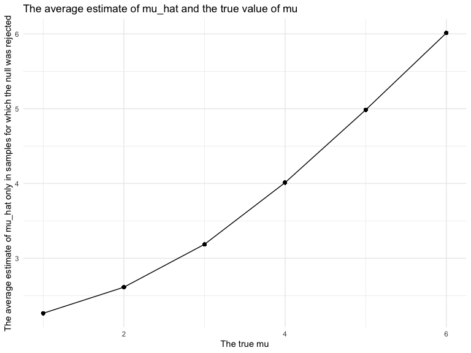

p8105_hw5_yc4016
================
Yishan Chen
2022-11-08

# Problem 1

#### Import dataset

``` r
full_df = 
  tibble(files = list.files("data/zip_data/"),
         path = str_c("data/zip_data/", files)) %>% 
  mutate(data = map(path, read_csv)) %>% 
  unnest()
```

#### Tidy dataset

``` r
tidy_df = 
  full_df %>% 
  mutate(files = str_replace(files, ".csv", ""),
         group = str_sub(files, 1, 3)) %>% 
  pivot_longer(week_1:week_8,
               names_to = "week",
               values_to = "outcome",
               names_prefix = "week_") %>% 
  mutate(week = as.numeric(week)) %>% 
  select(group, subj = files, week, outcome)
```

#### Create scatter plot

``` r
tidy_df %>% 
  ggplot(aes(x = week, y = outcome, group = subj, color = group)) + 
  geom_point() + 
  geom_path() + 
  facet_grid(~group)
```


-   This plot suggests high within-subject correlation – subjects who
    start above average end up above average, and those that start below
    average end up below average.
-   Subjects in the control group generally don’t change over time, but
    those in the experiment group increase their outcome in a roughly
    linear way.

# Problem 2

``` r
homicide_df = 
  read_csv("./data/homicide-data.csv") %>% 
  mutate(city_state = str_c(city, state, sep = ", ", collapse = NULL),
         city_state = ifelse(city_state == "Tulsa, AL", "Tulsa, OK", city_state),
         homicide_situation = case_when(disposition == "Closed without arrest" ~ "unsolved",
                                        disposition == "Open/No arrest"        ~ "unsolved",
                                        disposition == "Closed by arrest"      ~ "solved")) %>% 
  
  select(-city, -state) 
```

    ## Rows: 52179 Columns: 12
    ## ── Column specification ────────────────────────────────────────────────────────
    ## Delimiter: ","
    ## chr (9): uid, victim_last, victim_first, victim_race, victim_age, victim_sex...
    ## dbl (3): reported_date, lat, lon
    ## 
    ## ℹ Use `spec()` to retrieve the full column specification for this data.
    ## ℹ Specify the column types or set `show_col_types = FALSE` to quiet this message.

``` r
homicide_df
```

    ## # A tibble: 52,179 × 12
    ##    uid       repor…¹ victi…² victi…³ victi…⁴ victi…⁵ victi…⁶   lat   lon dispo…⁷
    ##    <chr>       <dbl> <chr>   <chr>   <chr>   <chr>   <chr>   <dbl> <dbl> <chr>  
    ##  1 Alb-0000…  2.01e7 GARCIA  JUAN    Hispan… 78      Male     35.1 -107. Closed…
    ##  2 Alb-0000…  2.01e7 MONTOYA CAMERON Hispan… 17      Male     35.1 -107. Closed…
    ##  3 Alb-0000…  2.01e7 SATTER… VIVIANA White   15      Female   35.1 -107. Closed…
    ##  4 Alb-0000…  2.01e7 MENDIO… CARLOS  Hispan… 32      Male     35.1 -107. Closed…
    ##  5 Alb-0000…  2.01e7 MULA    VIVIAN  White   72      Female   35.1 -107. Closed…
    ##  6 Alb-0000…  2.01e7 BOOK    GERALD… White   91      Female   35.2 -107. Open/N…
    ##  7 Alb-0000…  2.01e7 MALDON… DAVID   Hispan… 52      Male     35.1 -107. Closed…
    ##  8 Alb-0000…  2.01e7 MALDON… CONNIE  Hispan… 52      Female   35.1 -107. Closed…
    ##  9 Alb-0000…  2.01e7 MARTIN… GUSTAVO White   56      Male     35.1 -107. Open/N…
    ## 10 Alb-0000…  2.01e7 HERRERA ISRAEL  Hispan… 43      Male     35.1 -107. Open/N…
    ## # … with 52,169 more rows, 2 more variables: city_state <chr>,
    ## #   homicide_situation <chr>, and abbreviated variable names ¹​reported_date,
    ## #   ²​victim_last, ³​victim_first, ⁴​victim_race, ⁵​victim_age, ⁶​victim_sex,
    ## #   ⁷​disposition

##### Find total number of homicides by cities and total number of unsolved homicides by cities.

``` r
homicide_number = 
  homicide_df %>% 
  group_by(city_state) %>% 
  summarize(total_homicide = n(),
            total_homicide_unsolved = sum(homicide_situation == "unsolved"))

homicide_number
```

    ## # A tibble: 50 × 3
    ##    city_state      total_homicide total_homicide_unsolved
    ##    <chr>                    <int>                   <int>
    ##  1 Albuquerque, NM            378                     146
    ##  2 Atlanta, GA                973                     373
    ##  3 Baltimore, MD             2827                    1825
    ##  4 Baton Rouge, LA            424                     196
    ##  5 Birmingham, AL             800                     347
    ##  6 Boston, MA                 614                     310
    ##  7 Buffalo, NY                521                     319
    ##  8 Charlotte, NC              687                     206
    ##  9 Chicago, IL               5535                    4073
    ## 10 Cincinnati, OH             694                     309
    ## # … with 40 more rows

#### Estimate the proportion of homicides that are unsolved for baltimore.

``` r
baltimore = 
  homicide_number %>% 
  filter(city_state == "Baltimore, MD")

baltimore
```

    ## # A tibble: 1 × 3
    ##   city_state    total_homicide total_homicide_unsolved
    ##   <chr>                  <int>                   <int>
    ## 1 Baltimore, MD           2827                    1825

``` r
prop.test(baltimore %>% pull(total_homicide_unsolved), 
          baltimore %>% pull(total_homicide)) %>% 
broom::tidy() %>% 
  select(estimate, conf.low, conf.high) %>%
  knitr::kable()
```

|  estimate |  conf.low | conf.high |
|----------:|----------:|----------:|
| 0.6455607 | 0.6275625 | 0.6631599 |

#### Estimate the proportion of unsolved homicides and the confidence interval for each of the cities.

``` r
each_cities = 
  homicide_number %>% 
  mutate(prop_cities = map2(.x = total_homicide_unsolved, .y = total_homicide, ~prop.test(x = .x, n = .y)),
         tidy_cities = map(.x = prop_cities, ~ broom::tidy(.x))) %>% 
  unnest(tidy_cities) %>% 
  select(city_state, estimate, conf.low, conf.high) %>% 
  janitor::clean_names() %>% 
  select(city_state, estimate, conf_low, conf_high) 
  
each_cities %>% 
  knitr::kable()
```

| city_state         |  estimate |  conf_low | conf_high |
|:-------------------|----------:|----------:|----------:|
| Albuquerque, NM    | 0.3862434 | 0.3372604 | 0.4375766 |
| Atlanta, GA        | 0.3833505 | 0.3528119 | 0.4148219 |
| Baltimore, MD      | 0.6455607 | 0.6275625 | 0.6631599 |
| Baton Rouge, LA    | 0.4622642 | 0.4141987 | 0.5110240 |
| Birmingham, AL     | 0.4337500 | 0.3991889 | 0.4689557 |
| Boston, MA         | 0.5048860 | 0.4646219 | 0.5450881 |
| Buffalo, NY        | 0.6122841 | 0.5687990 | 0.6540879 |
| Charlotte, NC      | 0.2998544 | 0.2660820 | 0.3358999 |
| Chicago, IL        | 0.7358627 | 0.7239959 | 0.7473998 |
| Cincinnati, OH     | 0.4452450 | 0.4079606 | 0.4831439 |
| Columbus, OH       | 0.5304428 | 0.5002167 | 0.5604506 |
| Dallas, TX         | 0.4811742 | 0.4561942 | 0.5062475 |
| Denver, CO         | 0.5416667 | 0.4846098 | 0.5976807 |
| Detroit, MI        | 0.5883287 | 0.5687903 | 0.6075953 |
| Durham, NC         | 0.3659420 | 0.3095874 | 0.4260936 |
| Fort Worth, TX     | 0.4644809 | 0.4222542 | 0.5072119 |
| Fresno, CA         | 0.3470226 | 0.3051013 | 0.3913963 |
| Houston, TX        | 0.5074779 | 0.4892447 | 0.5256914 |
| Indianapolis, IN   | 0.4493192 | 0.4223156 | 0.4766207 |
| Jacksonville, FL   | 0.5111301 | 0.4820460 | 0.5401402 |
| Kansas City, MO    | 0.4084034 | 0.3803996 | 0.4370054 |
| Las Vegas, NV      | 0.4141926 | 0.3881284 | 0.4407395 |
| Long Beach, CA     | 0.4126984 | 0.3629026 | 0.4642973 |
| Los Angeles, CA    | 0.4900310 | 0.4692208 | 0.5108754 |
| Louisville, KY     | 0.4531250 | 0.4120609 | 0.4948235 |
| Memphis, TN        | 0.3190225 | 0.2957047 | 0.3432691 |
| Miami, FL          | 0.6048387 | 0.5685783 | 0.6400015 |
| Milwaukee, wI      | 0.3614350 | 0.3333172 | 0.3905194 |
| Minneapolis, MN    | 0.5109290 | 0.4585150 | 0.5631099 |
| Nashville, TN      | 0.3624511 | 0.3285592 | 0.3977401 |
| New Orleans, LA    | 0.6485356 | 0.6231048 | 0.6731615 |
| New York, NY       | 0.3875598 | 0.3494421 | 0.4270755 |
| Oakland, CA        | 0.5364308 | 0.5040588 | 0.5685037 |
| Oklahoma City, OK  | 0.4851190 | 0.4467861 | 0.5236245 |
| Omaha, NE          | 0.4132029 | 0.3653146 | 0.4627477 |
| Philadelphia, PA   | 0.4478103 | 0.4300380 | 0.4657157 |
| Phoenix, AZ        | 0.5514223 | 0.5184825 | 0.5839244 |
| Pittsburgh, PA     | 0.5340729 | 0.4942706 | 0.5734545 |
| Richmond, VA       | 0.2634033 | 0.2228571 | 0.3082658 |
| Sacramento, CA     | 0.3696809 | 0.3211559 | 0.4209131 |
| San Antonio, TX    | 0.4285714 | 0.3947772 | 0.4630331 |
| San Bernardino, CA | 0.6181818 | 0.5576628 | 0.6753422 |
| San Diego, CA      | 0.3796095 | 0.3354259 | 0.4258315 |
| San Francisco, CA  | 0.5067873 | 0.4680516 | 0.5454433 |
| Savannah, GA       | 0.4674797 | 0.4041252 | 0.5318665 |
| St. Louis, MO      | 0.5396541 | 0.5154369 | 0.5636879 |
| Stockton, CA       | 0.5990991 | 0.5517145 | 0.6447418 |
| Tampa, FL          | 0.4567308 | 0.3881009 | 0.5269851 |
| Tulsa, OK          | 0.3304795 | 0.2927201 | 0.3705039 |
| Washington, DC     | 0.4379182 | 0.4112495 | 0.4649455 |

#### Create a plot that shows the estimates and CIs for each city

``` r
plot_each_cities =
  each_cities %>% 
  mutate(city_state = fct_reorder(city_state, estimate)) %>% 
  ggplot(aes(x = city_state, y = estimate)) +
  geom_point() +
  theme(axis.text.x = element_text(angle = 90, hjust = 1)) +
  geom_errorbar(aes(ymin = conf_low, ymax = conf_high)) +
  labs(title = "Estimates and confidence intervals of unsolved homocide for each city",
       x = "cities") 

plot_each_cities
```


# Problem 3

#### Create function

``` r
norm_mean_p = function(n=30, mu, sigma = 5) {
  norm_data = tibble(x = rnorm(n, mean = mu, sd = sigma))
  norm_data %>% 
    t.test (mu = 0, alpha = 0.05, conf.level = 0.95) %>% 
    broom::tidy ()
}

norm_mean_p
```

    ## function(n=30, mu, sigma = 5) {
    ##   norm_data = tibble(x = rnorm(n, mean = mu, sd = sigma))
    ##   norm_data %>% 
    ##     t.test (mu = 0, alpha = 0.05, conf.level = 0.95) %>% 
    ##     broom::tidy ()
    ## }

#### Test mean = 0

``` r
norm_results_0 = 
  expand_grid(n = 30, 
              mu = 0, 
              sigma = 5,
              iteration = 1:5000) %>% 
  mutate(estimate_df = map(mu, ~norm_mean_p(mu=.x))) %>% 
  unnest(estimate_df) 

norm_results_0
```

    ## # A tibble: 5,000 × 12
    ##        n    mu sigma iteration estimate statis…¹ p.value param…² conf.…³ conf.…⁴
    ##    <dbl> <dbl> <dbl>     <int>    <dbl>    <dbl>   <dbl>   <dbl>   <dbl>   <dbl>
    ##  1    30     0     5         1  1.35     1.25     0.222       29  -0.863   3.56 
    ##  2    30     0     5         2  0.295    0.360    0.721       29  -1.38    1.97 
    ##  3    30     0     5         3  0.368    0.488    0.629       29  -1.17    1.91 
    ##  4    30     0     5         4 -1.91    -2.50     0.0185      29  -3.47   -0.344
    ##  5    30     0     5         5  0.255    0.373    0.712       29  -1.14    1.65 
    ##  6    30     0     5         6  1.42     1.79     0.0835      29  -0.200   3.03 
    ##  7    30     0     5         7  1.03     1.37     0.180       29  -0.505   2.57 
    ##  8    30     0     5         8 -0.00168 -0.00151  0.999       29  -2.27    2.27 
    ##  9    30     0     5         9  0.865    1.24     0.223       29  -0.557   2.29 
    ## 10    30     0     5        10  0.172    0.199    0.844       29  -1.59    1.94 
    ## # … with 4,990 more rows, 2 more variables: method <chr>, alternative <chr>,
    ## #   and abbreviated variable names ¹​statistic, ²​parameter, ³​conf.low,
    ## #   ⁴​conf.high

#### Test mu = {1,2,3,4,5,6}

``` r
norm_results = 
  expand_grid(n = 30, 
              mu = c(1,2,3,4,5,6),
              sigma = 5,
              iteration = 1:5000) %>% 
  mutate(estimate_df = map(mu, ~norm_mean_p(mu=.x))) %>% 
  unnest(estimate_df)

norm_results
```

    ## # A tibble: 30,000 × 12
    ##        n    mu sigma iteration estimate statis…¹ p.value param…² conf.…³ conf.…⁴
    ##    <dbl> <dbl> <dbl>     <int>    <dbl>    <dbl>   <dbl>   <dbl>   <dbl>   <dbl>
    ##  1    30     1     5         1    0.420    0.572  0.572       29 -1.08     1.92 
    ##  2    30     1     5         2    2.20     2.11   0.0437      29  0.0663   4.33 
    ##  3    30     1     5         3    1.81     2.08   0.0461      29  0.0333   3.59 
    ##  4    30     1     5         4   -0.278   -0.250  0.804       29 -2.55     2.00 
    ##  5    30     1     5         5    0.295    0.371  0.713       29 -1.33     1.92 
    ##  6    30     1     5         6    0.665    0.625  0.537       29 -1.51     2.84 
    ##  7    30     1     5         7    0.818    0.800  0.430       29 -1.27     2.91 
    ##  8    30     1     5         8    2.73     2.60   0.0144      29  0.586    4.88 
    ##  9    30     1     5         9    0.990    1.31   0.199       29 -0.551    2.53 
    ## 10    30     1     5        10   -0.817   -1.00   0.323       29 -2.48     0.846
    ## # … with 29,990 more rows, 2 more variables: method <chr>, alternative <chr>,
    ## #   and abbreviated variable names ¹​statistic, ²​parameter, ³​conf.low,
    ## #   ⁴​conf.high

#### Plot showing the proportion of times the null was rejected and the true value of mu.

``` r
plot1 = 
  norm_results%>%
    group_by(mu) %>%
    summarize(sum_all = n(),
              sum_reject = sum(p.value < 0.05)) %>% 
    mutate (proportion_rejected = sum_reject / sum_all) %>% 
    ggplot(aes(x = mu, y = proportion_rejected)) + 
    geom_point() + 
    geom_line() + 
    labs(title = "The proportion of times the null was rejected and the true value of mu", 
       x = "The true means",
       y = "The proportion of times the null was rejected") 

plot1
```


-   The proportion of times the null was rejected increases when the
    value of true mean increases.
-   So the effect size and power have positive relationship.
-   So the effect size increases, the power also increases.

#### Plot showing the average estimate of mu_hat and the true value of mu.

``` r
plot2 = 
  norm_results %>%
    group_by(mu) %>%
    mutate(ave_estimate_mu_hat = mean(estimate)) %>%
    ggplot(aes(x = mu, y = ave_estimate_mu_hat)) + 
    geom_point() +
    geom_line() + 
    labs(title = "The average estimate of mu_hat and the true value of mu", 
         x = "The true mu", 
         y = "The average estimate of mu_hat") 
plot2
```


#### Plot showing the average estimate of mu_hat only in samples for which the null was rejectedand the true value of mu.

``` r
plot3 = 
  norm_results %>%
    group_by(mu) %>%
    filter(p.value < 0.05) %>% 
    mutate(ave_estimate_mu_hat = mean(estimate)) %>%
    ggplot(aes(x = mu, y = ave_estimate_mu_hat)) + 
    geom_point() + 
    geom_line() + 
    labs(title = "The average estimate of mu_hat and the true value of mu", 
         x = "The true mu", 
         y = "The average estimate of mu_hat only in samples for which the null was rejected") 
plot3
```



-   The sample average of mu_hat across tests for which the null is
    rejected approximately equal to the true value of mu.
-   When true mean is less than and equal to 3, the average estimate of
    mu_hat in samples for which the null was rejected is larger than the
    the average estimate of mu_hat in all. When true mean is larger than
    and equal to 4, these two value are approximately same.
-   When sample mean is small, the effect size and power are small.
-   Larger samples results and larger mu_hat could lead the average
    value of mu_hat approximately equal to the true value of mu.
