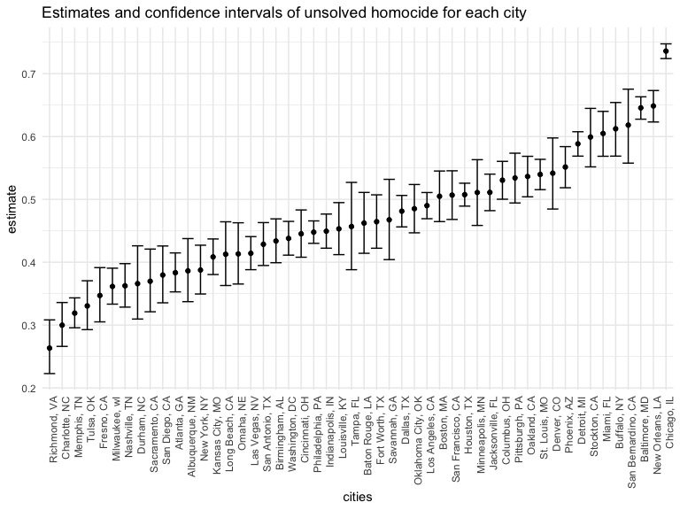
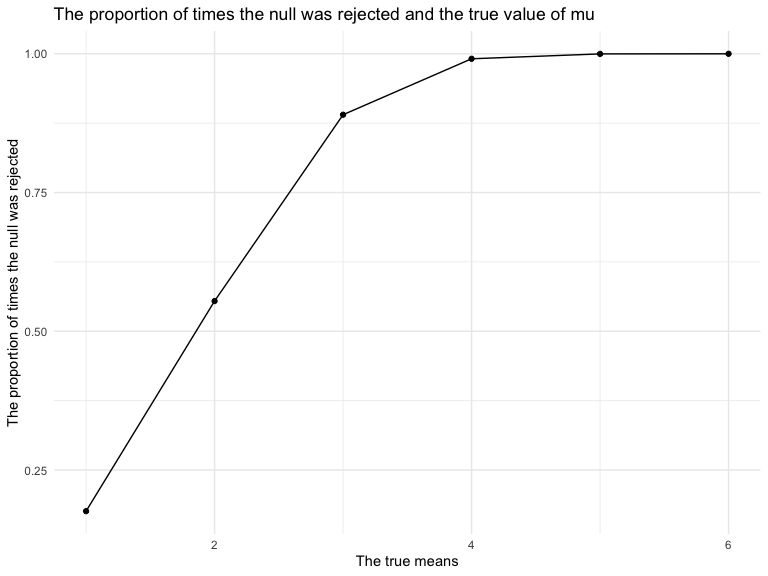

p8105_hw5_yc4016
================
Yishan Chen
2022-11-08

# Problem 1

### Question

The code chunk below imports the data in individual spreadsheets
contained in `./data/zip_data/`. To do this, I create a dataframe that
includes the list of all files in that directory and the complete path
to each file. As a next step, I `map` over paths and import data using
the `read_csv` function. Finally, I `unnest` the result of `map`.

``` r
full_df = 
  tibble(
    files = list.files("data/zip_data/"),
    path = str_c("data/zip_data/", files)
  ) %>% 
  mutate(data = map(path, read_csv)) %>% 
  unnest()
```

    ## Rows: 1 Columns: 8
    ## ── Column specification ────────────────────────────────────────────────────────
    ## Delimiter: ","
    ## dbl (8): week_1, week_2, week_3, week_4, week_5, week_6, week_7, week_8
    ## 
    ## ℹ Use `spec()` to retrieve the full column specification for this data.
    ## ℹ Specify the column types or set `show_col_types = FALSE` to quiet this message.
    ## Rows: 1 Columns: 8
    ## ── Column specification ────────────────────────────────────────────────────────
    ## Delimiter: ","
    ## dbl (8): week_1, week_2, week_3, week_4, week_5, week_6, week_7, week_8
    ## 
    ## ℹ Use `spec()` to retrieve the full column specification for this data.
    ## ℹ Specify the column types or set `show_col_types = FALSE` to quiet this message.
    ## Rows: 1 Columns: 8
    ## ── Column specification ────────────────────────────────────────────────────────
    ## Delimiter: ","
    ## dbl (8): week_1, week_2, week_3, week_4, week_5, week_6, week_7, week_8
    ## 
    ## ℹ Use `spec()` to retrieve the full column specification for this data.
    ## ℹ Specify the column types or set `show_col_types = FALSE` to quiet this message.
    ## Rows: 1 Columns: 8
    ## ── Column specification ────────────────────────────────────────────────────────
    ## Delimiter: ","
    ## dbl (8): week_1, week_2, week_3, week_4, week_5, week_6, week_7, week_8
    ## 
    ## ℹ Use `spec()` to retrieve the full column specification for this data.
    ## ℹ Specify the column types or set `show_col_types = FALSE` to quiet this message.
    ## Rows: 1 Columns: 8
    ## ── Column specification ────────────────────────────────────────────────────────
    ## Delimiter: ","
    ## dbl (8): week_1, week_2, week_3, week_4, week_5, week_6, week_7, week_8
    ## 
    ## ℹ Use `spec()` to retrieve the full column specification for this data.
    ## ℹ Specify the column types or set `show_col_types = FALSE` to quiet this message.
    ## Rows: 1 Columns: 8
    ## ── Column specification ────────────────────────────────────────────────────────
    ## Delimiter: ","
    ## dbl (8): week_1, week_2, week_3, week_4, week_5, week_6, week_7, week_8
    ## 
    ## ℹ Use `spec()` to retrieve the full column specification for this data.
    ## ℹ Specify the column types or set `show_col_types = FALSE` to quiet this message.
    ## Rows: 1 Columns: 8
    ## ── Column specification ────────────────────────────────────────────────────────
    ## Delimiter: ","
    ## dbl (8): week_1, week_2, week_3, week_4, week_5, week_6, week_7, week_8
    ## 
    ## ℹ Use `spec()` to retrieve the full column specification for this data.
    ## ℹ Specify the column types or set `show_col_types = FALSE` to quiet this message.
    ## Rows: 1 Columns: 8
    ## ── Column specification ────────────────────────────────────────────────────────
    ## Delimiter: ","
    ## dbl (8): week_1, week_2, week_3, week_4, week_5, week_6, week_7, week_8
    ## 
    ## ℹ Use `spec()` to retrieve the full column specification for this data.
    ## ℹ Specify the column types or set `show_col_types = FALSE` to quiet this message.
    ## Rows: 1 Columns: 8
    ## ── Column specification ────────────────────────────────────────────────────────
    ## Delimiter: ","
    ## dbl (8): week_1, week_2, week_3, week_4, week_5, week_6, week_7, week_8
    ## 
    ## ℹ Use `spec()` to retrieve the full column specification for this data.
    ## ℹ Specify the column types or set `show_col_types = FALSE` to quiet this message.
    ## Rows: 1 Columns: 8
    ## ── Column specification ────────────────────────────────────────────────────────
    ## Delimiter: ","
    ## dbl (8): week_1, week_2, week_3, week_4, week_5, week_6, week_7, week_8
    ## 
    ## ℹ Use `spec()` to retrieve the full column specification for this data.
    ## ℹ Specify the column types or set `show_col_types = FALSE` to quiet this message.
    ## Rows: 1 Columns: 8
    ## ── Column specification ────────────────────────────────────────────────────────
    ## Delimiter: ","
    ## dbl (8): week_1, week_2, week_3, week_4, week_5, week_6, week_7, week_8
    ## 
    ## ℹ Use `spec()` to retrieve the full column specification for this data.
    ## ℹ Specify the column types or set `show_col_types = FALSE` to quiet this message.
    ## Rows: 1 Columns: 8
    ## ── Column specification ────────────────────────────────────────────────────────
    ## Delimiter: ","
    ## dbl (8): week_1, week_2, week_3, week_4, week_5, week_6, week_7, week_8
    ## 
    ## ℹ Use `spec()` to retrieve the full column specification for this data.
    ## ℹ Specify the column types or set `show_col_types = FALSE` to quiet this message.
    ## Rows: 1 Columns: 8
    ## ── Column specification ────────────────────────────────────────────────────────
    ## Delimiter: ","
    ## dbl (8): week_1, week_2, week_3, week_4, week_5, week_6, week_7, week_8
    ## 
    ## ℹ Use `spec()` to retrieve the full column specification for this data.
    ## ℹ Specify the column types or set `show_col_types = FALSE` to quiet this message.
    ## Rows: 1 Columns: 8
    ## ── Column specification ────────────────────────────────────────────────────────
    ## Delimiter: ","
    ## dbl (8): week_1, week_2, week_3, week_4, week_5, week_6, week_7, week_8
    ## 
    ## ℹ Use `spec()` to retrieve the full column specification for this data.
    ## ℹ Specify the column types or set `show_col_types = FALSE` to quiet this message.
    ## Rows: 1 Columns: 8
    ## ── Column specification ────────────────────────────────────────────────────────
    ## Delimiter: ","
    ## dbl (8): week_1, week_2, week_3, week_4, week_5, week_6, week_7, week_8
    ## 
    ## ℹ Use `spec()` to retrieve the full column specification for this data.
    ## ℹ Specify the column types or set `show_col_types = FALSE` to quiet this message.
    ## Rows: 1 Columns: 8
    ## ── Column specification ────────────────────────────────────────────────────────
    ## Delimiter: ","
    ## dbl (8): week_1, week_2, week_3, week_4, week_5, week_6, week_7, week_8
    ## 
    ## ℹ Use `spec()` to retrieve the full column specification for this data.
    ## ℹ Specify the column types or set `show_col_types = FALSE` to quiet this message.
    ## Rows: 1 Columns: 8
    ## ── Column specification ────────────────────────────────────────────────────────
    ## Delimiter: ","
    ## dbl (8): week_1, week_2, week_3, week_4, week_5, week_6, week_7, week_8
    ## 
    ## ℹ Use `spec()` to retrieve the full column specification for this data.
    ## ℹ Specify the column types or set `show_col_types = FALSE` to quiet this message.
    ## Rows: 1 Columns: 8
    ## ── Column specification ────────────────────────────────────────────────────────
    ## Delimiter: ","
    ## dbl (8): week_1, week_2, week_3, week_4, week_5, week_6, week_7, week_8
    ## 
    ## ℹ Use `spec()` to retrieve the full column specification for this data.
    ## ℹ Specify the column types or set `show_col_types = FALSE` to quiet this message.
    ## Rows: 1 Columns: 8
    ## ── Column specification ────────────────────────────────────────────────────────
    ## Delimiter: ","
    ## dbl (8): week_1, week_2, week_3, week_4, week_5, week_6, week_7, week_8
    ## 
    ## ℹ Use `spec()` to retrieve the full column specification for this data.
    ## ℹ Specify the column types or set `show_col_types = FALSE` to quiet this message.
    ## Rows: 1 Columns: 8
    ## ── Column specification ────────────────────────────────────────────────────────
    ## Delimiter: ","
    ## dbl (8): week_1, week_2, week_3, week_4, week_5, week_6, week_7, week_8
    ## 
    ## ℹ Use `spec()` to retrieve the full column specification for this data.
    ## ℹ Specify the column types or set `show_col_types = FALSE` to quiet this message.

The result of the previous code chunk isn’t tidy – data are wide rather
than long, and some important variables are included as parts of others.
The code chunk below tides the data using string manipulations on the
file, converting from wide to long, and selecting relevant variables.

``` r
tidy_df = 
  full_df %>% 
  mutate(
    files = str_replace(files, ".csv", ""),
    group = str_sub(files, 1, 3)) %>% 
  pivot_longer(
    week_1:week_8,
    names_to = "week",
    values_to = "outcome",
    names_prefix = "week_") %>% 
  mutate(week = as.numeric(week)) %>% 
  select(group, subj = files, week, outcome)
```

Finally, the code chunk below creates a plot showing individual data,
faceted by group.

``` r
tidy_df %>% 
  ggplot(aes(x = week, y = outcome, group = subj, color = group)) + 
  geom_point() + 
  geom_path() + 
  facet_grid(~group)
```


This plot suggests high within-subject correlation – subjects who start
above average end up above average, and those that start below average
end up below average. Subjects in the control group generally don’t
change over time, but those in the experiment group increase their
outcome in a roughly linear way.

# Problem 2

``` r
homicide_df = 
  read_csv("./data/homicide-data.csv") %>% 
  mutate(city_state = str_c(city, state, sep = ", ", collapse = NULL),
         city_state = ifelse(city_state == "Tulsa, AL", "Tulsa, OK", city_state),
         homicide_situation = case_when(disposition == "Closed without arrest" ~ "unsolved",
                                        disposition == "Open/No arrest"        ~ "unsolved",
                                        disposition == "Closed by arrest"      ~ "solved")) %>% 
  
  select(-city, -state) 
```

    ## Rows: 52179 Columns: 12
    ## ── Column specification ────────────────────────────────────────────────────────
    ## Delimiter: ","
    ## chr (9): uid, victim_last, victim_first, victim_race, victim_age, victim_sex...
    ## dbl (3): reported_date, lat, lon
    ## 
    ## ℹ Use `spec()` to retrieve the full column specification for this data.
    ## ℹ Specify the column types or set `show_col_types = FALSE` to quiet this message.

``` r
homicide_df
```

    ## # A tibble: 52,179 × 12
    ##    uid       repor…¹ victi…² victi…³ victi…⁴ victi…⁵ victi…⁶   lat   lon dispo…⁷
    ##    <chr>       <dbl> <chr>   <chr>   <chr>   <chr>   <chr>   <dbl> <dbl> <chr>  
    ##  1 Alb-0000…  2.01e7 GARCIA  JUAN    Hispan… 78      Male     35.1 -107. Closed…
    ##  2 Alb-0000…  2.01e7 MONTOYA CAMERON Hispan… 17      Male     35.1 -107. Closed…
    ##  3 Alb-0000…  2.01e7 SATTER… VIVIANA White   15      Female   35.1 -107. Closed…
    ##  4 Alb-0000…  2.01e7 MENDIO… CARLOS  Hispan… 32      Male     35.1 -107. Closed…
    ##  5 Alb-0000…  2.01e7 MULA    VIVIAN  White   72      Female   35.1 -107. Closed…
    ##  6 Alb-0000…  2.01e7 BOOK    GERALD… White   91      Female   35.2 -107. Open/N…
    ##  7 Alb-0000…  2.01e7 MALDON… DAVID   Hispan… 52      Male     35.1 -107. Closed…
    ##  8 Alb-0000…  2.01e7 MALDON… CONNIE  Hispan… 52      Female   35.1 -107. Closed…
    ##  9 Alb-0000…  2.01e7 MARTIN… GUSTAVO White   56      Male     35.1 -107. Open/N…
    ## 10 Alb-0000…  2.01e7 HERRERA ISRAEL  Hispan… 43      Male     35.1 -107. Open/N…
    ## # … with 52,169 more rows, 2 more variables: city_state <chr>,
    ## #   homicide_situation <chr>, and abbreviated variable names ¹​reported_date,
    ## #   ²​victim_last, ³​victim_first, ⁴​victim_race, ⁵​victim_age, ⁶​victim_sex,
    ## #   ⁷​disposition

##### Find total number of homicides by cities and total number of unsolved homicides by cities.

``` r
homicide_number = 
  homicide_df %>% 
  group_by(city_state) %>% 
  summarize(total_homicide = n(),
            total_homicide_unsolved = sum(homicide_situation == "unsolved"))

homicide_number
```

    ## # A tibble: 50 × 3
    ##    city_state      total_homicide total_homicide_unsolved
    ##    <chr>                    <int>                   <int>
    ##  1 Albuquerque, NM            378                     146
    ##  2 Atlanta, GA                973                     373
    ##  3 Baltimore, MD             2827                    1825
    ##  4 Baton Rouge, LA            424                     196
    ##  5 Birmingham, AL             800                     347
    ##  6 Boston, MA                 614                     310
    ##  7 Buffalo, NY                521                     319
    ##  8 Charlotte, NC              687                     206
    ##  9 Chicago, IL               5535                    4073
    ## 10 Cincinnati, OH             694                     309
    ## # … with 40 more rows

#### Estimate the proportion of homicides that are unsolved for baltimore.

``` r
baltimore = 
  homicide_number %>% 
  filter(city_state == "Baltimore, MD")

baltimore
```

    ## # A tibble: 1 × 3
    ##   city_state    total_homicide total_homicide_unsolved
    ##   <chr>                  <int>                   <int>
    ## 1 Baltimore, MD           2827                    1825

``` r
prop.test(baltimore %>% pull(total_homicide_unsolved), 
          baltimore %>% pull(total_homicide)) %>% 
broom::tidy() 
```

    ## # A tibble: 1 × 8
    ##   estimate statistic  p.value parameter conf.low conf.high method        alter…¹
    ##      <dbl>     <dbl>    <dbl>     <int>    <dbl>     <dbl> <chr>         <chr>  
    ## 1    0.646      239. 6.46e-54         1    0.628     0.663 1-sample pro… two.si…
    ## # … with abbreviated variable name ¹​alternative

#### Estimate the proportion of unsolved homicides and the confidence interval for each of the cities.

``` r
each_cities = 
  homicide_number %>% 
  mutate(prop_cities = map2(.x = total_homicide_unsolved, .y = total_homicide, ~prop.test(x = .x, n = .y)),
         tidy_cities = map(.x = prop_cities, ~ broom::tidy(.x))) %>% 
  unnest(tidy_cities) %>% 
  select(-prop_cities, city_state, estimate, conf.low, conf.high) %>% 
  janitor::clean_names() 

each_cities
```

    ## # A tibble: 50 × 11
    ##    city_state  total…¹ total…² estim…³ stati…⁴   p_value param…⁵ conf_…⁶ conf_…⁷
    ##    <chr>         <int>   <int>   <dbl>   <dbl>     <dbl>   <int>   <dbl>   <dbl>
    ##  1 Albuquerqu…     378     146   0.386 1.91e+1 1.23e-  5       1   0.337   0.438
    ##  2 Atlanta, GA     973     373   0.383 5.25e+1 4.32e- 13       1   0.353   0.415
    ##  3 Baltimore,…    2827    1825   0.646 2.39e+2 6.46e- 54       1   0.628   0.663
    ##  4 Baton Roug…     424     196   0.462 2.27e+0 1.32e-  1       1   0.414   0.511
    ##  5 Birmingham…     800     347   0.434 1.38e+1 2.05e-  4       1   0.399   0.469
    ##  6 Boston, MA      614     310   0.505 4.07e-2 8.40e-  1       1   0.465   0.545
    ##  7 Buffalo, NY     521     319   0.612 2.58e+1 3.73e-  7       1   0.569   0.654
    ##  8 Charlotte,…     687     206   0.300 1.09e+2 1.41e- 25       1   0.266   0.336
    ##  9 Chicago, IL    5535    4073   0.736 1.23e+3 1.28e-269       1   0.724   0.747
    ## 10 Cincinnati…     694     309   0.445 8.11e+0 4.41e-  3       1   0.408   0.483
    ## # … with 40 more rows, 2 more variables: method <chr>, alternative <chr>, and
    ## #   abbreviated variable names ¹​total_homicide, ²​total_homicide_unsolved,
    ## #   ³​estimate, ⁴​statistic, ⁵​parameter, ⁶​conf_low, ⁷​conf_high

#### Create a plot that shows the estimates and CIs for each city

``` r
plot_each_cities =
  each_cities %>% 
  mutate(city_state = fct_reorder(city_state, estimate)) %>% 
  ggplot(aes(x = city_state, y = estimate)) +
  geom_point() +
  theme(axis.text.x = element_text(angle = 90, hjust = 1)) +
  geom_errorbar(aes(ymin = conf_low, ymax = conf_high)) +
  labs(title = "Estimates and confidence intervals of unsolved homocide for each city",x = "cities") 
plot_each_cities
```



# Problem 3

``` r
norm_mean_p = function(n=30, mu, sigma = 5) {
  norm_data = tibble(x = rnorm(n, mean = mu, sd = sigma))
  norm_data %>% 
    t.test (mu = 0, alpha = 0.05, conf.level = 0.95) %>% 
     broom::tidy ()
}

norm_mean_p
```

    ## function(n=30, mu, sigma = 5) {
    ##   norm_data = tibble(x = rnorm(n, mean = mu, sd = sigma))
    ##   norm_data %>% 
    ##     t.test (mu = 0, alpha = 0.05, conf.level = 0.95) %>% 
    ##      broom::tidy ()
    ## }

``` r
norm_results = 
  expand_grid(mu = c(0,1,2,3,4,5,6),
              iteration = 1:100) %>% 
  mutate(estimate_df = map(mu, ~norm_mean_p(mu=.x))) %>% 
  unnest(estimate_df)

norm_results
```

    ## # A tibble: 700 × 10
    ##       mu iterat…¹ estim…² stati…³ p.value param…⁴ conf.…⁵ conf.…⁶ method alter…⁷
    ##    <dbl>    <int>   <dbl>   <dbl>   <dbl>   <dbl>   <dbl>   <dbl> <chr>  <chr>  
    ##  1     0        1   0.305   0.398   0.693      29  -1.26     1.87 One S… two.si…
    ##  2     0        2   1.15    1.28    0.210      29  -0.682    2.98 One S… two.si…
    ##  3     0        3  -0.171  -0.191   0.850      29  -2.00     1.66 One S… two.si…
    ##  4     0        4   0.453   0.552   0.585      29  -1.22     2.13 One S… two.si…
    ##  5     0        5  -0.460  -0.433   0.668      29  -2.63     1.71 One S… two.si…
    ##  6     0        6   0.408   0.429   0.671      29  -1.54     2.35 One S… two.si…
    ##  7     0        7   0.288   0.319   0.752      29  -1.56     2.14 One S… two.si…
    ##  8     0        8   0.338   0.370   0.714      29  -1.53     2.21 One S… two.si…
    ##  9     0        9   0.151   0.134   0.894      29  -2.15     2.46 One S… two.si…
    ## 10     0       10  -0.520  -0.654   0.518      29  -2.14     1.10 One S… two.si…
    ## # … with 690 more rows, and abbreviated variable names ¹​iteration, ²​estimate,
    ## #   ³​statistic, ⁴​parameter, ⁵​conf.low, ⁶​conf.high, ⁷​alternative

#### Plot showing the proportion of times the null was rejected and the true value of mu.

``` r
plot1 = 
  norm_results%>%
    group_by(mu) %>%
    summarize(n_sum = n(),
              p_value_sum = sum(p.value < 0.05)) %>% 
    mutate (proportion_rejected = p_value_sum / n_sum) %>% 
  ggplot(aes(x = mu, y = proportion_rejected)) + 
  geom_point() + 
  labs(title = " The proportion of times the null was rejected and the true value of mu", 
       x = "The true value of means",
       y = "The proportion of times the null was rejected") 

plot1
```


-   The proportion of times the null was rejected increases when the
    value of true mean increases.
-   So the effect size and power have positive relationship.
-   So theeffect size increases, the power also increases.

#### Plot showing the average estimate of mu_hat and the true value of mu.

``` r
plot2 = 
  norm_results %>%
    group_by(mu) %>%
    summarize(ave_estimate_mu_hat = mean(estimate)) %>%
    ggplot(aes(x = mu, y = ave_estimate_mu_hat, group = mu)) + 
    geom_point() +
    labs(title = "The average estimate of mu_hat and the true value of mu", 
         x = "The true value of mu", 
         y = "The average estimate of mu_hat") 
plot2
```



#### Plot showing the average estimate of mu_hat only in samples for which the null was rejectedand the true value of mu.

``` r
plot3 = 
  norm_results %>%
    group_by(mu) %>%
    filter(p.value < 0.05) %>% 
    summarize(ave_estimate_mu_hat = mean(estimate)) %>%
    ggplot(aes(x = mu, y = ave_estimate_mu_hat, group = mu)) + 
    geom_point() + 
    labs(title = "The average estimate of mu_hat and the true value of mu", 
         x = "The true value of mu", 
         y = "The average estimate of mu_hat only in samples for which the null was rejected") 
plot3
```


-   Is the sample average of μ̂ across tests for which the null is
    rejected approximately equal to the true value of μ? Why or why not?
